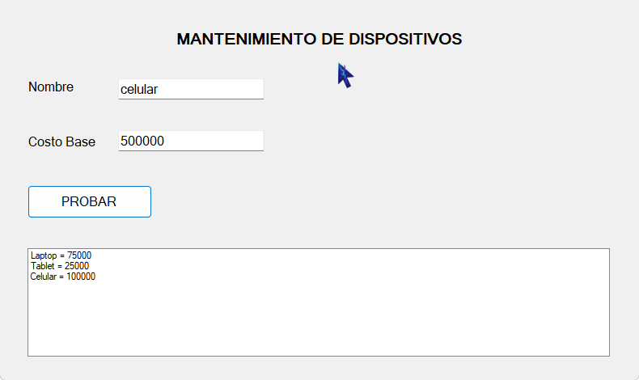

#SOLUCION: 

         ¿Por qué este código no aplica correctamente el polimorfismo y cómo solucionarlo en C#?

         El código original utilizaba el modificador 'new' para definir el método 'CalcularMantenimiento' en las clases derivadas (Laptop, Tablet, Celular).
          Esto no es polimorfismo, sino ocultación de métodos, lo que significa que el método en la clase derivada no sobrescribe el método en la clase base, sino que lo oculta. 
          Como resultado, cuando se llama al método a través de una referencia de la clase base, se invoca el método de la clase base en lugar del método de la clase derivada.         

        ¿La IA confundió sobrecarga con sobrescritura? 
        No el problema fue que el código original mezclaba sobrecarga y ocultación de métodos, 
        lo que impide el dispatch dinámico.

        ¿Propuso usar new en lugar de override? 

        no, la solución correcta es usar 'override' en lugar de 'new' para permitir el polimorfismo.

        - ¿La firma del método coincide con la de la clase base?

		Antes: no funcionaba correctamente. 
        La clase base solo tenía CalcularMantenimiento() virtual; Laptop usaba new (ocultaba, binding estático) y Tablet definía una firma distinta (CalcularMantenimiento(double)) por lo que no hacía override polimórfico. 
        Celular sí coincidía y era correcto.

        Ahora: tras los cambios correctos, la base debe declarar ambas firmas como virtual y las subclases deben usar override con la misma firma. 
        
		

# REFLEXION ESCRITA:

La IA propuso cambios efectivos en los cuales inicialmente propuso cambiar de new a override, y luego organizar el Polimorfismo
sin embargo, propuso la creación de archivos con un namespace sin tilde en la O , asi que tuvimos que cambiar manualmente los nombres
de los namespace en todos los archivos a un nombre sin tilde.
además, el codigo seguía funcionando a pesar de que no le mandabamos el valor de extra pero decidimos quitarlo porque no 
se estaba pidiendo en el formulario.
La IA inicialmente propuso una solución con la variable EXTRA pero nosotros preferimos eliminarla.

Aprendimos que a pesar de que la IA es una herramienta de código poderosa, no funciona correctamente sin el monitoreo 
de un desarrollador.

#ScreenShots

